# Langfuse Architecture Analysis

## Executive Summary

Langfuse is an open-source LLM engineering platform built as a **pnpm + Turbo monorepo** consisting of a Next.js 14 web application, an Express.js worker service, and shared packages. The architecture follows a **feature-based organization** pattern with dual database system (PostgreSQL + ClickHouse) to handle both transactional metadata and high-volume analytics data.

**Key Characteristics:**
- Type-safe full-stack development with tRPC
- Async event processing with BullMQ queues
- Feature-based modular architecture
- Dual database strategy for performance
- Comprehensive RBAC and multi-tenancy

---

## 1. System Architecture Overview

### 1.1 High-Level Component Diagram

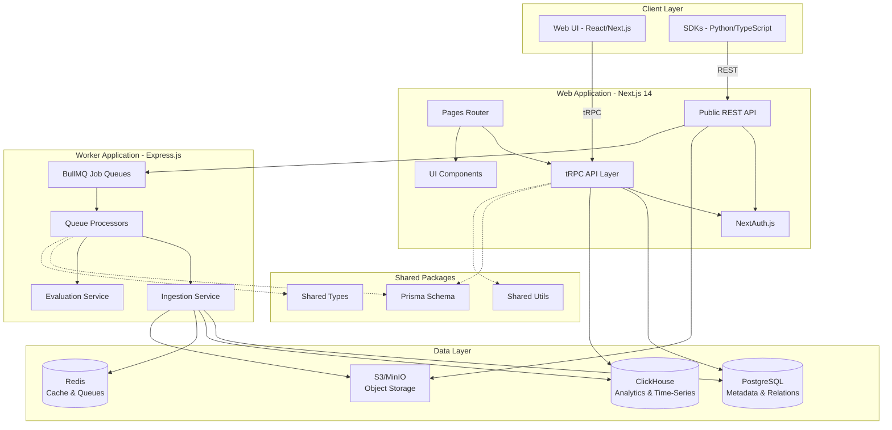

### 1.2 Monorepo Structure

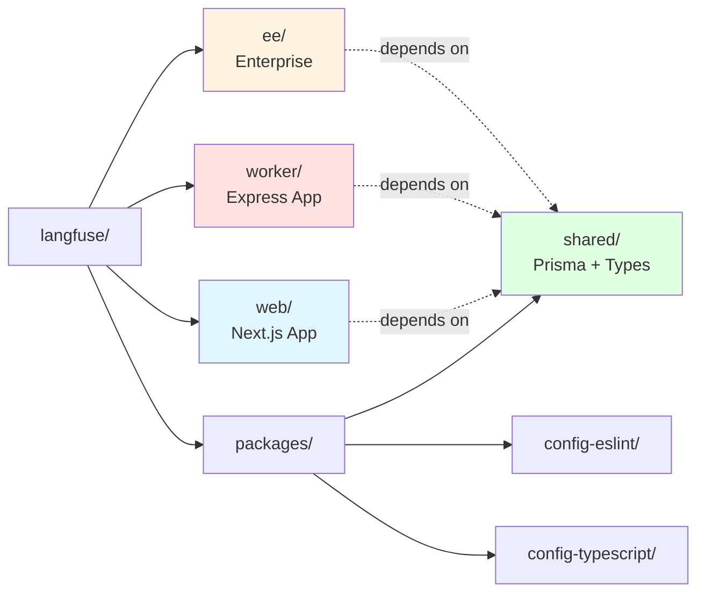

---

## 2. Web Application Architecture

### 2.1 Feature-Based Organization

The web application contains **50+ feature directories** in `/web/src/features/`:

```
features/
├── datasets/          # Dataset management
├── evals/            # Evaluation system
├── prompts/          # Prompt versioning
├── projects/         # Project settings
├── rbac/             # Access control
├── public-api/       # Public API types
├── auth/             # Authentication
├── organizations/    # Org management
├── dashboard/        # Analytics
├── experiments/      # A/B testing
└── ... (40+ more)
```

**Standard Feature Structure:**

```
features/[feature-name]/
├── components/          # React UI components
├── contexts/           # React contexts
├── server/
│   ├── [feature]Router.ts   # tRPC router
│   ├── service.ts          # Business logic
│   └── actions/            # Server actions
├── hooks/             # Custom React hooks
├── types/             # TypeScript types
└── utils/             # Helper functions
```

### 2.2 tRPC API Architecture

**Central Router:** `/web/src/server/api/root.ts`

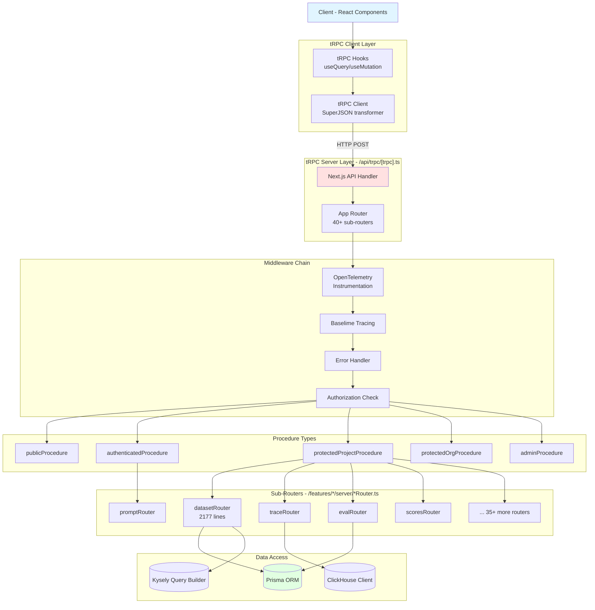

**Context Creation** (`/web/src/server/api/trpc.ts:42-72`):

```typescript
export const createInnerTRPCContext = (opts: CreateContextOptions) => {
  return {
    session: opts.session,      // User session (NextAuth)
    headers: opts.headers,       // HTTP headers
    prisma,                      // Prisma client
    DB,                          // Kysely query builder
  };
};
```

**Procedure Types with Middleware:**

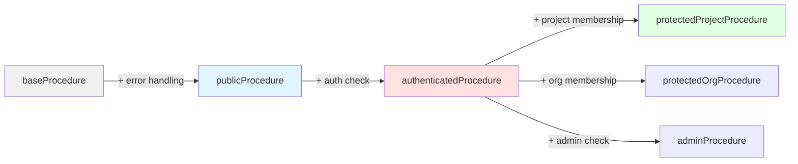

### 2.3 Public API Architecture

**Location:** `/web/src/pages/api/public/`

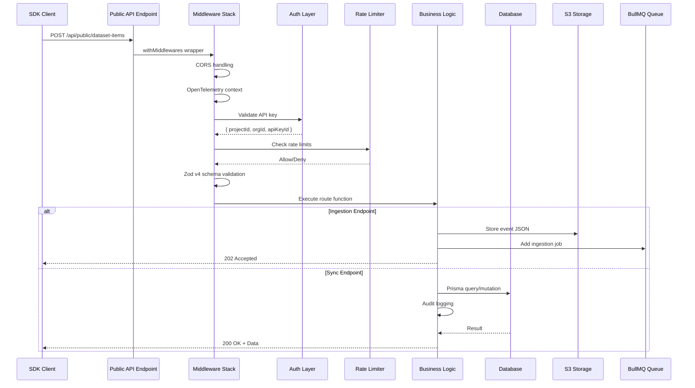

**Middleware Chain** (`/features/public-api/server/withMiddlewares.ts`):

1. CORS preflight handling
2. OpenTelemetry context propagation
3. Error handling (BaseError, ClickHouseResourceError, ZodError)
4. Route execution

**API Route Helpers:**

- `createAuthedAPIRoute` - Requires API key, no specific project
- `createAuthedProjectAPIRoute` - Requires project-scoped API key
- `createLegacyAuthedAPIRoute` - Legacy authentication

### 2.4 Pages and Routing

**Structure:**

```
pages/
├── _app.tsx                          # App wrapper with providers
├── api/
│   ├── trpc/[trpc].ts               # tRPC endpoint
│   └── public/                       # Public API endpoints
├── auth/                             # Auth pages (sign-in, etc.)
├── project/[projectId]/              # Project-scoped pages
│   ├── datasets/
│   ├── traces/
│   ├── prompts/
│   └── settings/
└── organization/[organizationId]/    # Org-scoped pages
    ├── settings/
    └── members/
```

**Page Example - Dataset List** (`/pages/project/[projectId]/datasets.tsx`):

```typescript
// 1. Component uses tRPC hook
const { data: datasets } = api.datasets.allDatasets.useQuery({ projectId });

// 2. Hook connects to tRPC client → HTTP request
// 3. Server middleware chain processes request
// 4. Router procedure executes with context
// 5. Database query via Prisma
// 6. Type-safe response returned to React Query cache
```

---

## 3. Worker Application Architecture

### 3.1 BullMQ Queue System

**Entry Point:** `/worker/src/app.ts` (522 lines)

The worker registers **30+ queue processors**:

```mermaid
graph TB
    subgraph "Queue Registration - app.ts"
        Manager[WorkerManager]
    end

    subgraph "Core Queues"
        Ingestion[IngestionQueue<br/>Sharded by projectId]
        OtelIngestion[OtelIngestionQueue]
        TraceUpsert[TraceUpsertQueue]
        EvalExec[EvaluationExecution]
    end

    subgraph "Data Processing Queues"
        BatchExport[BatchExportQueue]
        DatasetRun[DatasetRunItemUpsert]
        EventProp[EventPropagationQueue]
    end

    subgraph "Integration Queues"
        PostHog[PostHogIntegrationQueue]
        Webhook[WebhookQueue]
        CloudUsage[CloudUsageMeteringQueue]
    end

    subgraph "Admin Queues"
        DeleteProject[DeleteProjectQueue]
        LegacyMigration[LegacyIngestionQueue]
    end

    Manager --> Ingestion
    Manager --> OtelIngestion
    Manager --> TraceUpsert
    Manager --> EvalExec
    Manager --> BatchExport
    Manager --> DatasetRun
    Manager --> EventProp
    Manager --> PostHog
    Manager --> Webhook
    Manager --> CloudUsage
    Manager --> DeleteProject
    Manager --> LegacyMigration

    style Ingestion fill:#e1f5ff
    style EvalExec fill:#ffe1e1
    style BatchExport fill:#e1ffe1
```

**Worker Registration Pattern:**

```typescript
// Check if queue is enabled via env var
if (env.QUEUE_CONSUMER_INGESTION_QUEUE_IS_ENABLED === "true") {
  // Get shard names for parallel processing
  const shardNames = IngestionQueue.getShardNames();

  shardNames.forEach((shardName) => {
    WorkerManager.register(
      shardName as QueueName,
      ingestionQueueProcessorBuilder(true),
      {
        concurrency: env.LANGFUSE_INGESTION_QUEUE_PROCESSING_CONCURRENCY,
        lockDuration: 60000,      // 60s job lock
        stalledInterval: 120000   // 120s stalled check
      }
    );
  });
}
```

### 3.2 Ingestion Pipeline

**Complete Data Flow:**

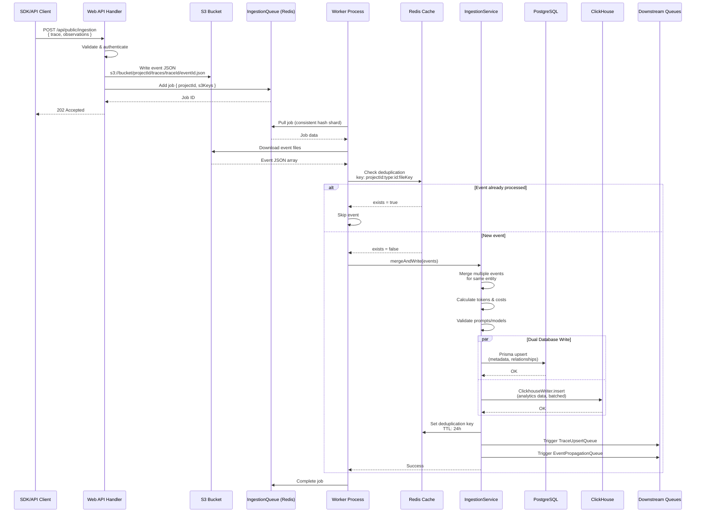

**Key Components:**

1. **S3 Event Storage** (`/worker/src/queues/ingestionQueue.ts:81-150`)
   - Events stored as JSON files
   - Batched downloads for efficiency
   - Fallback to legacy queue if S3 fails

2. **Redis Deduplication** (`/worker/src/queues/ingestionQueue.ts:81-103`)
   ```typescript
   const key = `langfuse:ingestion:recently-processed:${projectId}:${type}:${eventBodyId}:${fileKey}`;
   const exists = await redis.exists(key);
   if (exists) return; // Skip duplicate
   await redis.set(key, "1", "EX", 86400); // 24h TTL
   ```

3. **IngestionService** (`/worker/src/services/IngestionService/index.ts`)
   - Merges multiple events for same trace/observation
   - Async tokenization (tiktoken via worker threads)
   - Cost calculation from model pricing table
   - Validation against prompt versions and models
   - Dual database writes

4. **ClickhouseWriter** (`/worker/src/services/ClickhouseWriter/`)
   - Batched async inserts
   - Table-specific insert queues
   - Automatic flushing on size/time thresholds
   - Handles INSERT failures with retries

### 3.3 Evaluation Pipeline

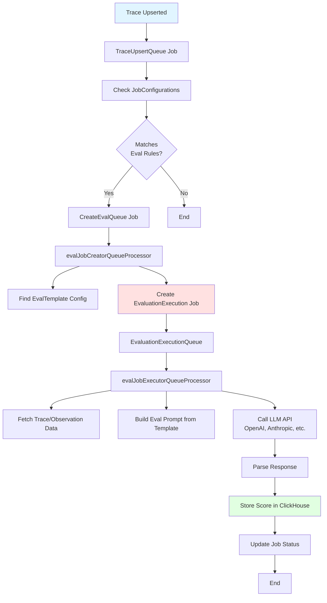

**Configuration-Driven Evaluation:**

- `JobConfiguration` table defines eval rules
- Matches traces based on filters (trace name, metadata, etc.)
- Triggers evaluation jobs automatically
- Supports custom LLM-based evaluators

---

## 4. Database Architecture

### 4.1 Dual Database Strategy

**Why Two Databases?**

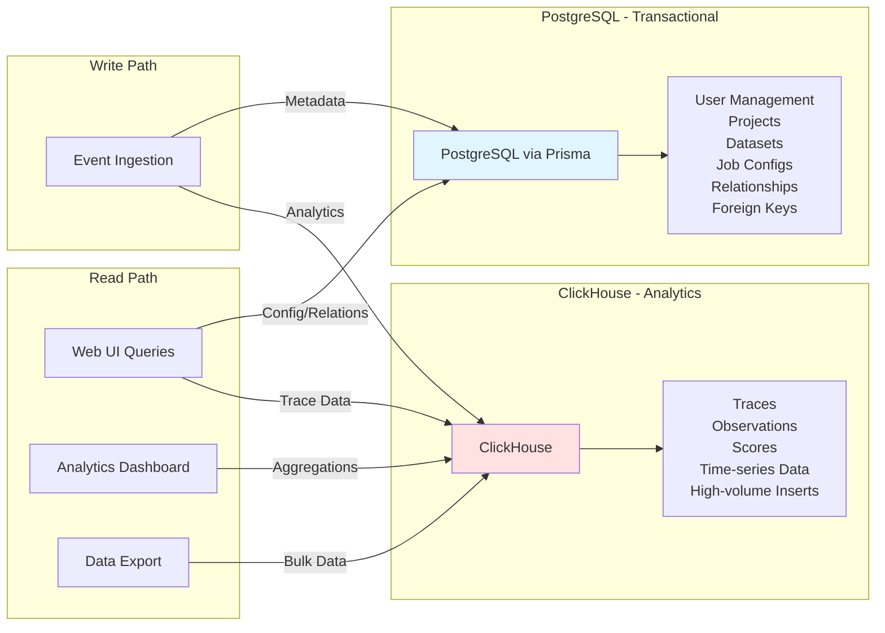

**Division of Responsibility:**

| PostgreSQL | ClickHouse |
|------------|------------|
| Users, Organizations | Trace records |
| Projects, Memberships | Observation records |
| Datasets, Items | Score records |
| Job Configurations | High-cardinality analytics |
| Prompt Versions | Time-series aggregations |
| Model Pricing | Session analytics |
| RBAC & Permissions | Generation metrics |
| Foreign Key Constraints | Event logs |

### 4.2 Prisma Schema Structure

**Location:** `/packages/shared/prisma/schema.prisma`

**Key Model Groups:**

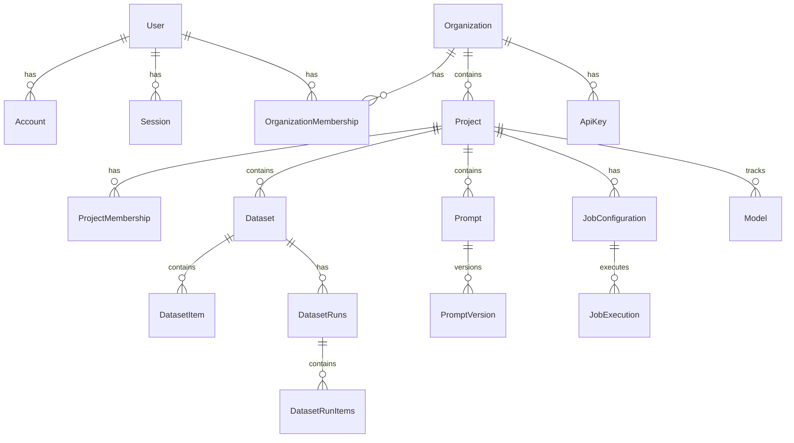

**Notable Design Decisions:**

1. **Legacy Metadata Tables:**
   - `Trace`, `Observation`, `Score` tables exist in PostgreSQL
   - Store only metadata (IDs, timestamps, project references)
   - Full data in ClickHouse
   - Allows joins with config tables

2. **No Foreign Keys for Event Data:**
   - Traces, observations can be ingested out of order
   - No FK constraints between trace → observations
   - Validation happens in application layer

3. **Multi-tenancy via `projectId`:**
   - All queries filtered by `projectId`
   - Enforced in tRPC middleware
   - Index optimization on `projectId` columns

### 4.3 ClickHouse Schema

**Location:** `/packages/shared/clickhouse/migrations/`

**Table Strategy:**

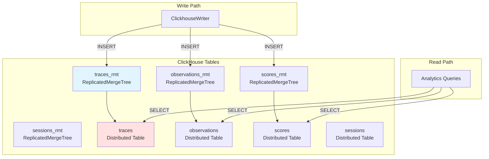

**Key Features:**

1. **ReplicatedMergeTree Engine:**
   - High-throughput inserts
   - Automatic data replication
   - Efficient compression

2. **Clustered vs. Unclustered:**
   - `_rmt` tables for replicated setups
   - Non-replicated versions for single-node
   - Migrations handle both variants

3. **Partitioning:**
   - By `project_id` for multi-tenancy isolation
   - By `timestamp` for time-range queries
   - Allows efficient data pruning

4. **Materialized Views:**
   - Pre-aggregated metrics
   - Session-level rollups
   - Cost tracking by model/project

### 4.4 Database Interaction Patterns

**Three Query Approaches:**

1. **Prisma ORM** - Type-safe, relational
   ```typescript
   await ctx.prisma.dataset.findMany({
     where: { projectId },
     include: {
       datasetItems: { take: 10 },
       _count: { select: { datasetRuns: true } }
     }
   });
   ```

2. **Kysely Query Builder** - Complex SQL, CTEs
   ```typescript
   const query = ctx.DB
     .selectFrom("datasets")
     .leftJoin("dataset_items", "dataset_items.dataset_id", "datasets.id")
     .select(({ fn, eb }) => [
       "datasets.id",
       fn.count("dataset_items.id").as("item_count"),
       eb.selectFrom("dataset_runs")
         .whereRef("dataset_runs.dataset_id", "=", "datasets.id")
         .select(fn.count("id").as("count"))
         .as("run_count")
     ])
     .where("datasets.project_id", "=", projectId)
     .groupBy("datasets.id");
   ```

3. **Raw SQL** - Maximum flexibility
   ```typescript
   await prisma.$queryRaw<Result[]>(
     Prisma.sql`
       WITH filtered_items AS (
         SELECT * FROM dataset_items
         WHERE dataset_id = ${datasetId}
         AND input @> ${inputFilter}::jsonb
       )
       SELECT * FROM filtered_items LIMIT ${limit}
     `
   );
   ```

**ClickHouse Client** (`@clickhouse/client`):
```typescript
const result = await clickhouseClient.query({
  query: `
    SELECT
      project_id,
      count() as trace_count,
      sum(total_cost) as total_cost
    FROM traces
    WHERE timestamp >= {start:DateTime64}
      AND timestamp < {end:DateTime64}
      AND project_id = {projectId:String}
    GROUP BY project_id
  `,
  query_params: { start, end, projectId },
  format: "JSONEachRow"
});
```

---

## 5. Authentication & Authorization

### 5.1 Multi-Layer Auth Architecture

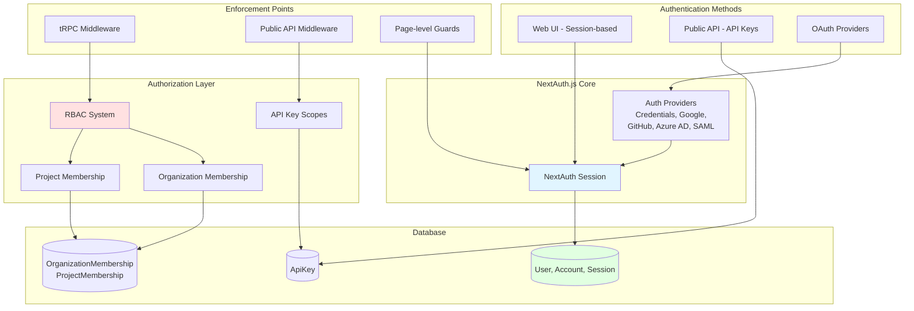

### 5.2 RBAC System

**Location:** `/web/src/features/rbac/`

**Role Hierarchy:**

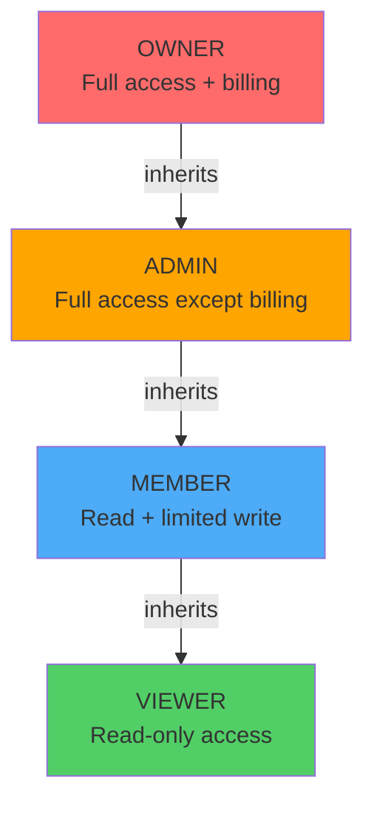

**Permission Scopes** (from `/web/src/features/rbac/constants/projectRoleAccessRights.ts`):

| Scope | Owner | Admin | Member | Viewer |
|-------|-------|-------|--------|--------|
| Project Settings | ✅ | ✅ | ❌ | ❌ |
| Create Prompts | ✅ | ✅ | ✅ | ❌ |
| Delete Traces | ✅ | ✅ | ❌ | ❌ |
| Manage API Keys | ✅ | ✅ | ❌ | ❌ |
| View Dashboard | ✅ | ✅ | ✅ | ✅ |
| Create Datasets | ✅ | ✅ | ✅ | ❌ |
| Score Traces | ✅ | ✅ | ✅ | ❌ |

**Enforcement in tRPC:**

```typescript
// Middleware checks role
export const protectedProjectProcedure = enforceUserIsAuthedAndProjectMember.use(
  async ({ ctx, next, input }) => {
    const projectId = input.projectId;

    // Check if user has project membership
    const membership = await ctx.prisma.projectMembership.findFirst({
      where: {
        userId: ctx.session.user.id,
        projectId: projectId
      }
    });

    if (!membership) {
      throw new TRPCError({ code: "UNAUTHORIZED" });
    }

    // Check specific scope if needed
    if (requiresScope("datasets:create")) {
      throwIfNoProjectAccess({
        session: ctx.session,
        projectId,
        scope: "datasets:create"
      });
    }

    return next({ ctx: { ...ctx, projectId } });
  }
);
```

### 5.3 API Key Scopes

**API keys can be:**
- **Project-scoped:** Access to single project
- **Organization-scoped:** Access to all projects in org

**Scope Validation:**

```typescript
// In public API middleware
export const createAuthedProjectAPIRoute = (config) => {
  return async (req, res) => {
    // Extract API key from header
    const apiKey = req.headers["x-langfuse-public-key"];

    // Validate key
    const auth = await verifyAuthHeaderAndReturnScope(req.headers);

    // Check project access
    if (auth.scope.projectId !== requestedProjectId) {
      throw new UnauthorizedError("API key does not have access to this project");
    }

    // Check rate limits
    await rateLimitResource(auth.scope.projectId, config.rateLimitResource);

    // Execute route
    return config.fn({ body: req.body, auth, query: req.query });
  };
};
```

---

## 6. Key Data Flows

### 6.1 Frontend → tRPC → Database

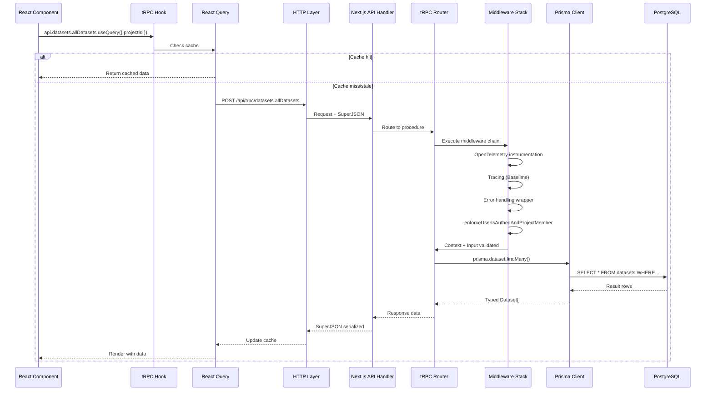

### 6.2 SDK → S3 → Worker → Databases

**Complete Ingestion Flow:**

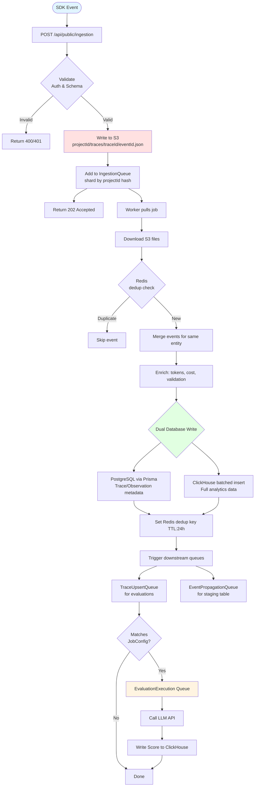

### 6.3 Evaluation Trigger Flow

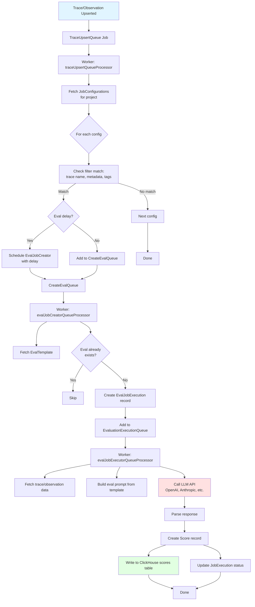

---

## 7. Pros and Cons Analysis

### 7.1 Architectural Strengths

#### 1. Type Safety End-to-End
**Pros:**
- tRPC provides full-stack type safety without code generation
- Changes to backend types immediately surface in frontend
- Zod schemas ensure runtime validation matches TypeScript types
- Reduces bugs from type mismatches

**Evidence:**
- 40+ tRPC routers with shared input/output schemas
- SuperJSON serialization handles complex types (Date, BigInt)
- Kysely provides type-safe SQL query building

#### 2. Feature-Based Architecture
**Pros:**
- High cohesion: related code co-located in `/features/[name]/`
- Easy to understand feature boundaries
- Parallel team development without conflicts
- Clear ownership of feature domains

**Evidence:**
- 50+ feature directories with consistent structure
- Each feature has own router, services, components
- Examples: `datasets/`, `evals/`, `prompts/`

#### 3. Dual Database Strategy
**Pros:**
- PostgreSQL handles relational data with ACID guarantees
- ClickHouse handles high-volume analytics efficiently
- Separation of concerns: config vs. analytics
- Optimal performance for each use case

**Evidence:**
- Metadata writes to PostgreSQL via Prisma
- Analytics writes to ClickHouse via batched inserts
- ClickHouse queries 10-100x faster for aggregations

#### 4. Async Processing with Queues
**Pros:**
- Non-blocking ingestion (202 Accepted immediately)
- Horizontal scaling via worker instances
- Retry logic for failed jobs
- Isolated worker failures don't affect web app

**Evidence:**
- 30+ BullMQ queues for different job types
- Sharded queues for parallel processing
- S3 event storage allows replay

#### 5. Modular Monorepo
**Pros:**
- Shared code in `/packages/shared/` (DRY principle)
- Single repository for web + worker + types
- Turbo caching speeds up builds
- Consistent tooling (ESLint, TypeScript)

**Evidence:**
- pnpm workspaces link packages
- Shared Prisma schema, types, utilities
- Single `pnpm dev` starts all services

#### 6. Comprehensive Authorization
**Pros:**
- Multi-tenancy isolation via `projectId` filtering
- RBAC with granular scopes
- Middleware enforcement prevents bypasses
- Both session-based and API key auth

**Evidence:**
- tRPC middleware checks membership
- RBAC system with 4 role levels
- Public API validates API key scopes

#### 7. Observability Built-In
**Pros:**
- OpenTelemetry instrumentation on all requests
- Distributed tracing with Baselime
- Error tracking with Sentry
- Custom event logging

**Evidence:**
- `withOtelInstrumentation` middleware
- `traceException()` helper for structured errors
- OpenTelemetry context propagation across services

### 7.2 Architectural Weaknesses

#### 1. Large Router Files
**Cons:**
- Some routers exceed 2000 lines (e.g., `dataset-router.ts`: 2177 lines)
- Difficult to navigate and understand
- Harder to review in PRs
- Increased merge conflicts

**Impact:** Medium
**Evidence:** `/features/datasets/server/dataset-router.ts`: 2177 lines

#### 2. Dual Database Complexity
**Cons:**
- Must write to both PostgreSQL + ClickHouse for each event
- Data consistency challenges (eventual consistency)
- Complex migrations (must update both schemas)
- Debugging requires checking two databases

**Impact:** High
**Evidence:** IngestionService writes to both databases

#### 3. S3 as Message Queue
**Cons:**
- S3 not designed as queue intermediary
- Additional latency vs. direct writes
- Costs for S3 storage + requests
- Complexity of downloading files in worker

**Impact:** Medium
**Rationale:** Provides durability and replay capability

#### 4. Tight Coupling to Next.js Pages Router
**Cons:**
- Pages Router is being superseded by App Router
- Migration to App Router would be significant effort
- Server components not available
- Layout patterns less elegant

**Impact:** Medium
**Evidence:** 100+ page files in `/pages/`

#### 5. Monorepo Complexity
**Cons:**
- Large repository (100k+ LOC)
- Long initial setup time (`pnpm i`)
- Docker dependencies required (PostgreSQL, ClickHouse, Redis)
- Difficult for new contributors

**Impact:** Low
**Tradeoff:** Benefits of monorepo outweigh costs

#### 6. Queue Processor Logic in Single File
**Cons:**
- `app.ts` (522 lines) registers 30+ queues
- Large conditional blocks for each queue
- Hard to test individual processors
- Difficult to enable/disable queues

**Impact:** Low

#### 7. Implicit Feature Dependencies
**Cons:**
- Features can import from other features
- No enforced boundaries between features
- Risk of circular dependencies
- Hard to extract features to separate packages

**Impact:** Medium
**Evidence:** Cross-feature imports in `/features/`

#### 8. Limited API Documentation
**Cons:**
- Public API docs via Fern require manual updates
- tRPC endpoints not documented for external consumption
- Internal API endpoints lack JSDoc comments
- Onboarding requires reading code

**Impact:** Low for internal use, High for API consumers

#### 9. Test Coverage Gaps
**Cons:**
- Many features lack comprehensive tests
- Integration tests require full stack (DB, Redis, ClickHouse)
- Async tests difficult to write correctly
- Mock complexity for queue processors

**Impact:** Medium
**Evidence:** Test instructions emphasize avoiding `pruneDatabase`

#### 10. ClickHouse Schema Evolution
**Cons:**
- Adding columns to ClickHouse requires migration + rebuild
- Large tables take hours to ALTER
- No easy rollback for schema changes
- Clustered deployments require coordination

**Impact:** High for production

---

## 8. Improvement Suggestions

### 8.1 Code Organization

#### 1. Split Large Router Files
**Problem:** Routers with 2000+ lines are hard to maintain

**Solution:**
```typescript
// Before: single file with 50 procedures
// features/datasets/server/dataset-router.ts (2177 lines)

// After: split into logical sub-routers
features/datasets/server/
├── index.ts                    // Re-exports combined router
├── dataset-crud-router.ts      // Create, read, update, delete
├── dataset-items-router.ts     // Dataset items operations
├── dataset-runs-router.ts      // Run management
└── dataset-export-router.ts    // Export operations

// features/datasets/server/index.ts
export const datasetRouter = createTRPCRouter({
  ...datasetCrudRouter,
  ...datasetItemsRouter,
  ...datasetRunsRouter,
  ...datasetExportRouter,
});
```

**Benefits:**
- Easier to navigate and understand
- Smaller PR diffs
- Reduced merge conflicts
- Clear separation of concerns

**Effort:** Medium (requires careful refactoring)

#### 2. Enforce Feature Boundaries
**Problem:** Features can arbitrarily import from other features

**Solution:**
Implement architectural boundaries with ESLint rules:

```javascript
// .eslintrc.js
module.exports = {
  rules: {
    "import/no-restricted-paths": ["error", {
      zones: [
        {
          target: "./src/features/datasets",
          from: "./src/features/!(datasets|shared)",
          message: "Datasets feature should not depend on other features directly"
        }
      ]
    }]
  }
};
```

**Alternative:** Create a `/features/shared/` directory for cross-cutting concerns

**Benefits:**
- Prevents circular dependencies
- Clearer feature boundaries
- Easier to extract to microservices later

**Effort:** Low (add ESLint rule + fix violations)

#### 3. Extract Service Layer
**Problem:** Business logic mixed in tRPC routers

**Solution:**
```typescript
// Before: logic in router
export const datasetRouter = createTRPCRouter({
  create: protectedProjectProcedure
    .input(CreateDatasetSchema)
    .mutation(async ({ ctx, input }) => {
      // 50+ lines of business logic here
      const dataset = await ctx.prisma.dataset.create({ ... });
      await auditLog({ ... });
      return dataset;
    })
});

// After: extract to service
// features/datasets/server/service.ts
export class DatasetService {
  constructor(
    private prisma: PrismaClient,
    private auditLogger: AuditLogger
  ) {}

  async createDataset(input: CreateDatasetInput, userId: string) {
    // Business logic here
    const dataset = await this.prisma.dataset.create({ ... });
    await this.auditLogger.log({ ... });
    return dataset;
  }
}

// features/datasets/server/dataset-router.ts
export const datasetRouter = createTRPCRouter({
  create: protectedProjectProcedure
    .input(CreateDatasetSchema)
    .mutation(async ({ ctx, input }) => {
      const service = new DatasetService(ctx.prisma, ctx.auditLogger);
      return service.createDataset(input, ctx.session.user.id);
    })
});
```

**Benefits:**
- Testable business logic (no tRPC mocking needed)
- Reusable across tRPC + Public API + Workers
- Clearer separation of concerns

**Effort:** High (requires refactoring many routers)

### 8.2 Database & Performance

#### 4. Implement Read Replicas
**Problem:** Analytics queries compete with transactional writes

**Solution:**
```typescript
// Separate read/write Prisma clients
const prismaWrite = new PrismaClient();
const prismaRead = new PrismaClient({
  datasources: {
    db: { url: env.DATABASE_READ_REPLICA_URL }
  }
});

// Use in context
export const createTRPCContext = (opts) => {
  return {
    prisma: prismaWrite,        // For mutations
    prismaReadOnly: prismaRead, // For queries
    // ...
  };
};

// Apply in routers
export const datasetRouter = createTRPCRouter({
  allDatasets: protectedProjectProcedure
    .query(async ({ ctx }) => {
      // Use read replica for queries
      return ctx.prismaReadOnly.dataset.findMany({ ... });
    }),

  create: protectedProjectProcedure
    .mutation(async ({ ctx }) => {
      // Use write DB for mutations
      return ctx.prisma.dataset.create({ ... });
    })
});
```

**Benefits:**
- Reduced load on primary database
- Faster read queries
- Better scalability

**Effort:** Low (infrastructure change + code update)

#### 5. Implement Query Result Caching
**Problem:** Same queries repeated frequently

**Solution:**
```typescript
// Add Redis caching layer
import { createRedisCache } from "@/server/cache";

const cache = createRedisCache({
  ttl: 60, // 1 minute
  keyPrefix: "trpc:query:"
});

// Wrap queries with cache
export const cachedQuery = <TInput, TOutput>(
  procedure: ProcedureBuilder,
  cacheKey: (input: TInput) => string,
  ttl: number = 60
) => {
  return procedure.use(async ({ ctx, next, input }) => {
    const key = cacheKey(input);

    // Check cache
    const cached = await cache.get<TOutput>(key);
    if (cached) return { ...ctx, data: cached };

    // Execute query
    const result = await next({ ctx });

    // Store in cache
    await cache.set(key, result.data, ttl);

    return result;
  });
};

// Use in router
export const datasetRouter = createTRPCRouter({
  allDatasets: cachedQuery(
    protectedProjectProcedure,
    (input) => `datasets:all:${input.projectId}`,
    300 // 5 minutes
  )
  .input(z.object({ projectId: z.string() }))
  .query(async ({ ctx, input }) => {
    return ctx.prisma.dataset.findMany({ where: { projectId: input.projectId } });
  })
});
```

**Invalidation strategy:**
```typescript
// Invalidate on mutation
create: protectedProjectProcedure
  .mutation(async ({ ctx, input }) => {
    const dataset = await ctx.prisma.dataset.create({ ... });

    // Invalidate cache
    await cache.del(`datasets:all:${input.projectId}`);

    return dataset;
  })
```

**Benefits:**
- Reduced database load
- Faster response times
- Better UX

**Effort:** Medium

#### 6. Optimize ClickHouse Queries with Projections
**Problem:** Full table scans for common aggregations

**Solution:**
```sql
-- Create projection for common trace aggregations
ALTER TABLE traces_rmt
  ADD PROJECTION traces_by_project_date (
    SELECT
      project_id,
      toDate(timestamp) as date,
      count() as count,
      sum(total_cost) as total_cost,
      quantile(0.5)(latency) as p50_latency
    GROUP BY project_id, date
  );

-- Populate projection
ALTER TABLE traces_rmt MATERIALIZE PROJECTION traces_by_project_date;
```

**Benefits:**
- 10-100x faster aggregation queries
- Reduced query costs
- Pre-computed metrics

**Effort:** Low (SQL migration)

### 8.3 Queue & Worker Improvements

#### 7. Decouple S3 from Ingestion Path
**Problem:** S3 adds latency and costs

**Solution:**
```typescript
// Option A: Direct write to queue with large payload support
await IngestionQueue.add({
  projectId,
  events: largeEventArray, // Store in job data
  metadata: { ... }
});

// Option B: Hybrid approach - small events direct, large via S3
if (eventSize < 1MB) {
  await IngestionQueue.add({ projectId, events });
} else {
  await s3.upload(events);
  await IngestionQueue.add({ projectId, s3Key });
}

// Option C: Use Redis Streams for durability
await redis.xadd(
  `langfuse:ingestion:${projectId}`,
  '*',
  'events', JSON.stringify(events)
);
```

**Tradeoffs:**
- Option A: Simpler, but loses replay capability
- Option B: Best of both worlds, adds complexity
- Option C: Redis cost, but fast and durable

**Effort:** Medium

#### 8. Implement Queue Health Monitoring
**Problem:** Queue failures hard to detect

**Solution:**
```typescript
// Add health check endpoints
app.get("/health/queues", async (req, res) => {
  const queues = await WorkerManager.getAllQueues();

  const health = await Promise.all(
    queues.map(async (queue) => {
      const [waiting, active, failed, delayed] = await Promise.all([
        queue.getWaitingCount(),
        queue.getActiveCount(),
        queue.getFailedCount(),
        queue.getDelayedCount()
      ]);

      return {
        name: queue.name,
        waiting,
        active,
        failed,
        delayed,
        healthy: failed < 100 && waiting < 10000
      };
    })
  );

  res.json({ queues: health });
});

// Add Prometheus metrics
import { register, Counter, Gauge } from "prom-client";

const queueJobsProcessed = new Counter({
  name: "langfuse_queue_jobs_processed_total",
  help: "Total number of queue jobs processed",
  labelNames: ["queue", "status"]
});

const queueJobDuration = new Histogram({
  name: "langfuse_queue_job_duration_seconds",
  help: "Queue job processing duration",
  labelNames: ["queue"]
});
```

**Benefits:**
- Proactive alerting on queue issues
- Better observability
- Easier debugging

**Effort:** Low

### 8.4 API & Developer Experience

#### 9. Generate OpenAPI Docs from tRPC
**Problem:** tRPC endpoints not documented for external use

**Solution:**
Use `trpc-openapi` to auto-generate OpenAPI specs:

```typescript
// Install: pnpm add trpc-openapi

// web/src/server/api/trpc.ts
import { OpenApiMeta } from "trpc-openapi";

export const createTRPCRouter = t.router;
export const publicProcedure = t.procedure;

// Add OpenAPI metadata
export const openApiProcedure = t.procedure.meta<OpenApiMeta>();

// In routers:
export const datasetRouter = createTRPCRouter({
  allDatasets: openApiProcedure
    .meta({
      openapi: {
        method: "GET",
        path: "/api/datasets",
        tags: ["datasets"],
        summary: "List all datasets",
      }
    })
    .input(z.object({ projectId: z.string() }))
    .output(z.array(DatasetSchema))
    .query(async ({ ctx, input }) => { ... })
});

// Generate OpenAPI spec
import { generateOpenApiDocument } from "trpc-openapi";

const openApiDocument = generateOpenApiDocument(appRouter, {
  title: "Langfuse API",
  version: "1.0.0",
  baseUrl: "https://api.langfuse.com"
});

// Serve at /api/openapi.json
```

**Benefits:**
- Auto-generated docs stay in sync
- Support for OpenAPI tooling (Postman, Swagger UI)
- Better DX for API consumers

**Effort:** Medium

#### 10. Implement GraphQL Alongside tRPC
**Problem:** External developers prefer GraphQL over tRPC

**Solution:**
```typescript
// Add GraphQL layer on top of tRPC routers
import { createSchema, createYoga } from "graphql-yoga";

const schema = createSchema({
  typeDefs: `
    type Query {
      datasets(projectId: ID!): [Dataset!]!
    }

    type Dataset {
      id: ID!
      name: String!
      description: String
      items: [DatasetItem!]!
    }
  `,
  resolvers: {
    Query: {
      datasets: async (_, { projectId }, context) => {
        // Reuse tRPC router logic
        const caller = appRouter.createCaller(context);
        return caller.datasets.allDatasets({ projectId });
      }
    }
  }
});

const yoga = createYoga({ schema });
app.use("/api/graphql", yoga);
```

**Benefits:**
- Familiar API for GraphQL users
- Flexible querying
- Reuses existing business logic

**Effort:** High (requires schema definition + resolvers)

### 8.5 Testing & Quality

#### 11. Implement Contract Testing
**Problem:** Breaking changes between web and worker not caught

**Solution:**
```typescript
// Use Pact for contract testing
import { Pact } from "@pact-foundation/pact";

describe("Ingestion Queue Contract", () => {
  const provider = new Pact({
    consumer: "web-app",
    provider: "worker",
    port: 8080
  });

  it("should accept ingestion job with correct schema", async () => {
    await provider.addInteraction({
      state: "queue is ready",
      uponReceiving: "an ingestion job",
      withRequest: {
        method: "POST",
        path: "/queue/ingestion",
        body: {
          projectId: "proj_123",
          events: [{ type: "trace", id: "trace_123" }]
        }
      },
      willRespondWith: {
        status: 200,
        body: { jobId: "job_123" }
      }
    });

    // Test web app against mock
    await provider.verify();
  });
});
```

**Benefits:**
- Catches contract violations early
- Documents expected interfaces
- Safer refactoring

**Effort:** Medium

#### 12. Add Snapshot Testing for Database Migrations
**Problem:** Migrations can break queries

**Solution:**
```typescript
// packages/shared/prisma/tests/migration-snapshots.test.ts
import { execSync } from "child_process";
import { readFileSync } from "fs";

describe("Migration Snapshots", () => {
  it("should generate expected schema", () => {
    // Run migrations on test DB
    execSync("pnpm run db:migrate", { cwd: __dirname });

    // Generate current schema
    execSync("pnpm prisma db pull --print", { cwd: __dirname });
    const currentSchema = readFileSync("schema.prisma", "utf-8");

    // Compare to snapshot
    expect(currentSchema).toMatchSnapshot();
  });
});
```

**Benefits:**
- Detects unintended schema changes
- Documents schema evolution
- Catches migration errors

**Effort:** Low

### 8.6 Migration & Technical Debt

#### 13. Migrate to Next.js App Router
**Problem:** Pages Router is legacy, App Router is future

**Solution:**
Incremental migration strategy:

```
Phase 1: New features in App Router
  - Keep existing pages in /pages/
  - Add new pages in /app/
  - Next.js supports both simultaneously

Phase 2: Migrate read-only pages
  - Start with viewer pages (no auth complexity)
  - Use Server Components for performance
  - Migrate layouts first

Phase 3: Migrate interactive pages
  - Use Server Actions for mutations
  - Migrate tRPC to Server Components + Actions
  - Update authentication to App Router patterns

Phase 4: Remove Pages Router
  - Delete /pages/ (except API routes)
  - Keep /pages/api/ for tRPC + Public API
```

**Benefits:**
- Better performance (Server Components)
- Improved layouts and nested routing
- Future-proof architecture

**Effort:** Very High (months of work)

#### 14. Extract Features to Package Boundaries
**Problem:** Features tightly coupled to monolith

**Solution:**
```typescript
// Restructure as vertical slices with clear boundaries
packages/
├── feature-datasets/
│   ├── src/
│   │   ├── api/          # Public API (exports tRPC router)
│   │   ├── components/   # UI components
│   │   ├── domain/       # Business logic
│   │   └── db/           # Database queries
│   ├── package.json
│   └── tsconfig.json
├── feature-evals/
│   └── ...
└── feature-prompts/
    └── ...

// Web app imports features
import { datasetRouter } from "@langfuse/feature-datasets";
import { DatasetTable } from "@langfuse/feature-datasets/components";
```

**Benefits:**
- Clearer boundaries
- Easier to extract to microservices later
- Better encapsulation

**Effort:** Very High (major refactor)

---

## 9. Key Metrics & Scale Considerations

### 9.1 Current Scale Indicators

Based on codebase analysis:

- **Codebase Size:** ~100,000+ lines of TypeScript
- **Feature Count:** 50+ feature directories
- **tRPC Routers:** 40+ sub-routers
- **Queue Types:** 30+ BullMQ queues
- **Database Tables:** 50+ PostgreSQL tables, 10+ ClickHouse tables

### 9.2 Scalability Analysis

**Horizontal Scaling Capabilities:**

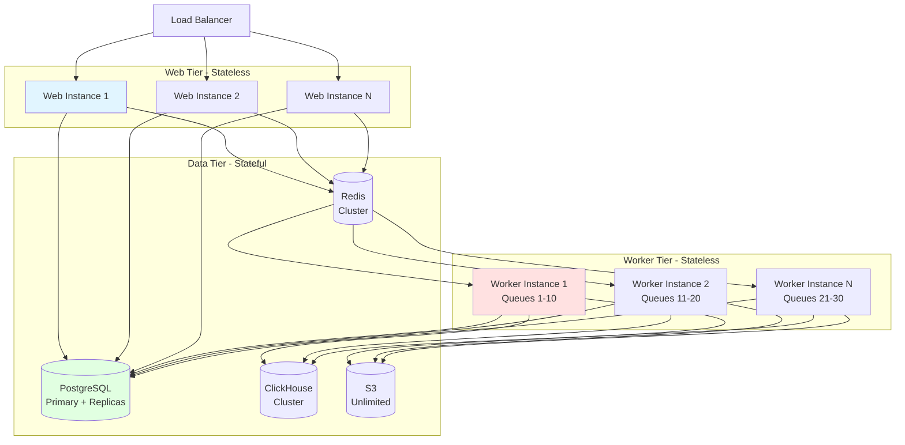

**Bottlenecks:**

1. **PostgreSQL Write Throughput**
   - Mitigations: Read replicas, connection pooling, batch writes
   - Scale ceiling: ~10k writes/sec on large instances

2. **ClickHouse Insert Rate**
   - Current: Batched inserts via ClickhouseWriter
   - Scale ceiling: 100k+ inserts/sec with proper sharding

3. **Redis Queue Throughput**
   - Current: Sharded queues by projectId
   - Scale ceiling: 100k+ jobs/sec with cluster

4. **S3 Request Rate**
   - Mitigation: Batch downloads, prefixes for parallelism
   - Scale ceiling: Effectively unlimited

**Recommended Optimizations for 10x Scale:**

1. Implement read replicas for PostgreSQL
2. Partition ClickHouse tables by project_id
3. Increase queue sharding (more shards per queue type)
4. Add Redis caching layer for frequent queries
5. Implement CDN for static assets and public data

---

## 10. Technology Stack Summary

### 10.1 Core Technologies

| Layer | Technology | Version | Purpose |
|-------|-----------|---------|---------|
| **Frontend** | React | 18 | UI library |
| | Next.js | 14 | Full-stack framework (Pages Router) |
| | Tailwind CSS | 3 | Styling |
| | shadcn/ui | Latest | Component library (Radix UI) |
| | TanStack Query | 5 | State management |
| **Backend** | tRPC | 11 | Type-safe API |
| | NextAuth.js | Latest | Authentication |
| | Prisma | 5 | PostgreSQL ORM |
| | Kysely | Latest | SQL query builder |
| | Zod | 4 | Runtime validation |
| **Worker** | Express.js | 4 | HTTP server |
| | BullMQ | 5 | Queue system |
| **Databases** | PostgreSQL | 15+ | Primary database |
| | ClickHouse | 24+ | Analytics database |
| | Redis | 7+ | Cache & queues |
| **Storage** | MinIO/S3 | N/A | Object storage |
| **Observability** | OpenTelemetry | Latest | Instrumentation |
| | Baselime | N/A | Tracing |
| | Sentry | Latest | Error tracking |
| **Tooling** | pnpm | 9.5.0 | Package manager |
| | Turbo | Latest | Monorepo build system |
| | TypeScript | 5+ | Type system |
| | ESLint | 8 | Linting |
| | Jest | 29 | Unit testing (web) |
| | Vitest | Latest | Unit testing (worker) |
| | Playwright | Latest | E2E testing |

### 10.2 Key Dependencies

**Web Application:**
- `@trpc/server`, `@trpc/client`, `@trpc/react-query`
- `next-auth` (authentication)
- `@prisma/client` (database)
- `@clickhouse/client` (analytics)
- `ioredis` (Redis client)
- `zod` (validation)
- `superjson` (serialization)
- `@radix-ui/*` (UI primitives)
- `recharts`, `@tremor/react` (charts)
- `ai` (Vercel AI SDK)

**Worker Application:**
- `bullmq` (job queues)
- `@aws-sdk/client-s3` (S3 client)
- `tiktoken` (tokenization)
- `express` (HTTP server)

**Shared:**
- `prisma` (ORM)
- `kysely` (query builder)
- `zod` (schemas)

---

## 11. Critical File Paths Reference

### 11.1 Configuration Files

| File | Purpose |
|------|---------|
| `/pnpm-workspace.yaml` | Monorepo package definitions |
| `/turbo.json` | Turbo build caching configuration |
| `/.nvmrc` | Node.js version (v24) |
| `/web/src/env.mjs` | Web environment variables |
| `/worker/src/env.ts` | Worker environment variables |
| `/packages/shared/prisma/schema.prisma` | Database schema |

### 11.2 Core Entry Points

| File | Purpose |
|------|---------|
| `/web/src/pages/_app.tsx` | Next.js app wrapper |
| `/web/src/pages/api/trpc/[trpc].ts` | tRPC API handler |
| `/web/src/server/api/root.ts` | tRPC router aggregation |
| `/web/src/server/api/trpc.ts` | tRPC procedures & middleware |
| `/worker/src/app.ts` | Worker queue registrations (522 lines) |
| `/worker/src/index.ts` | Worker HTTP server |

### 11.3 Key Feature Implementations

| Feature | Router | Lines | Key Files |
|---------|--------|-------|-----------|
| Datasets | `/features/datasets/server/dataset-router.ts` | 2177 | Large, should split |
| Evals | `/features/evals/server/evals-router.ts` | ~500 | Well-sized |
| Prompts | `/features/prompts/server/prompt-router.ts` | ~600 | Well-sized |
| Traces | `/features/traces/server/traces-router.ts` | ~1000 | Consider splitting |

### 11.4 Infrastructure Services

| Service | Location |
|---------|----------|
| Ingestion | `/worker/src/services/IngestionService/` |
| ClickHouse Writer | `/worker/src/services/ClickhouseWriter/` |
| Queue Definitions | `/packages/shared/src/server/queues/` |
| Error Handling | `/packages/shared/src/errors/` |
| Database Clients | `/packages/shared/src/server/db.ts` |

---

## 12. Conclusion

### 12.1 Overall Assessment

Langfuse demonstrates a **well-architected, production-grade LLM observability platform** with several notable strengths:

**Architectural Highlights:**
- Strong type safety through tRPC and TypeScript
- Clear feature boundaries with modular organization
- Effective dual database strategy for different workloads
- Robust async processing with BullMQ queues
- Comprehensive authorization with RBAC

**Primary Challenges:**
- Large router files need decomposition
- Dual database complexity requires careful coordination
- S3 intermediary adds latency to ingestion
- Pages Router is legacy, migration to App Router needed
- Limited test coverage in some areas

**Maturity Level:** Production-ready with room for optimization

### 12.2 Strategic Recommendations

**Short-Term (0-3 months):**
1. Split large router files (dataset-router.ts: 2177 lines)
2. Implement query result caching with Redis
3. Add queue health monitoring and metrics
4. Enforce feature boundaries with ESLint rules

**Medium-Term (3-6 months):**
1. Extract service layer from tRPC routers
2. Implement read replicas for PostgreSQL
3. Generate OpenAPI docs from tRPC
4. Decouple S3 from critical ingestion path

**Long-Term (6-12+ months):**
1. Migrate to Next.js App Router incrementally
2. Extract features to package boundaries
3. Implement contract testing between services
4. Consider GraphQL layer for external developers

### 12.3 Final Thoughts

The Langfuse architecture successfully balances:
- **Developer Experience:** Type-safe APIs, feature-based organization
- **Performance:** Dual databases, async processing, horizontal scaling
- **Maintainability:** Monorepo structure, shared packages, consistent patterns

The codebase demonstrates thoughtful engineering decisions and clear patterns that enable the team to iterate quickly while maintaining quality. The suggested improvements would further enhance scalability, maintainability, and developer productivity without requiring a fundamental architectural overhaul.

**Overall Grade: A-**

Strong foundation with clear paths for optimization and scale.

---

## Appendix: Useful Commands

```bash
# Development
pnpm run dev:web          # Start web app only (most common)
pnpm run dev              # Start all services

# Database
cd packages/shared
pnpm run db:migrate       # Run migrations
pnpm run db:generate      # Generate Prisma client
pnpm run db:reset         # Reset and seed

# Testing
pnpm test-sync --testPathPattern="path" --testNamePattern="test"  # Web sync tests
pnpm test -- --testPathPattern="path" --testNamePattern="test"    # Web async tests
pnpm run test --filter=worker -- file.test.ts -t "test name"     # Worker tests

# Infrastructure
pnpm run infra:dev:up     # Start Docker services
pnpm run infra:dev:down   # Stop Docker services

# Building
pnpm --filter=web run build      # Build web app
pnpm --filter=worker run build   # Build worker

# Utilities
pnpm run format           # Format all code
pnpm run lint             # Lint all code
```

---

**Document Version:** 1.0
**Last Updated:** 2025-11-13
**Author:** Architecture Analysis via Claude Code
**Repository:** https://github.com/langfuse/langfuse
