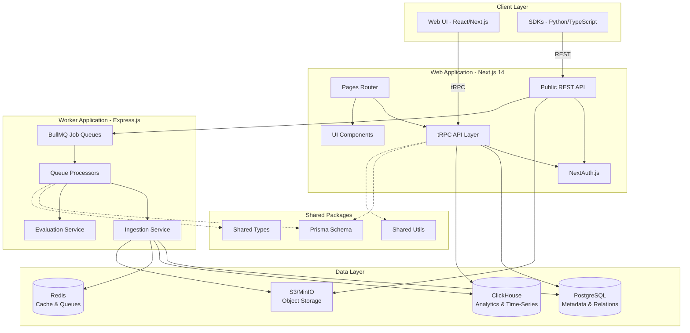
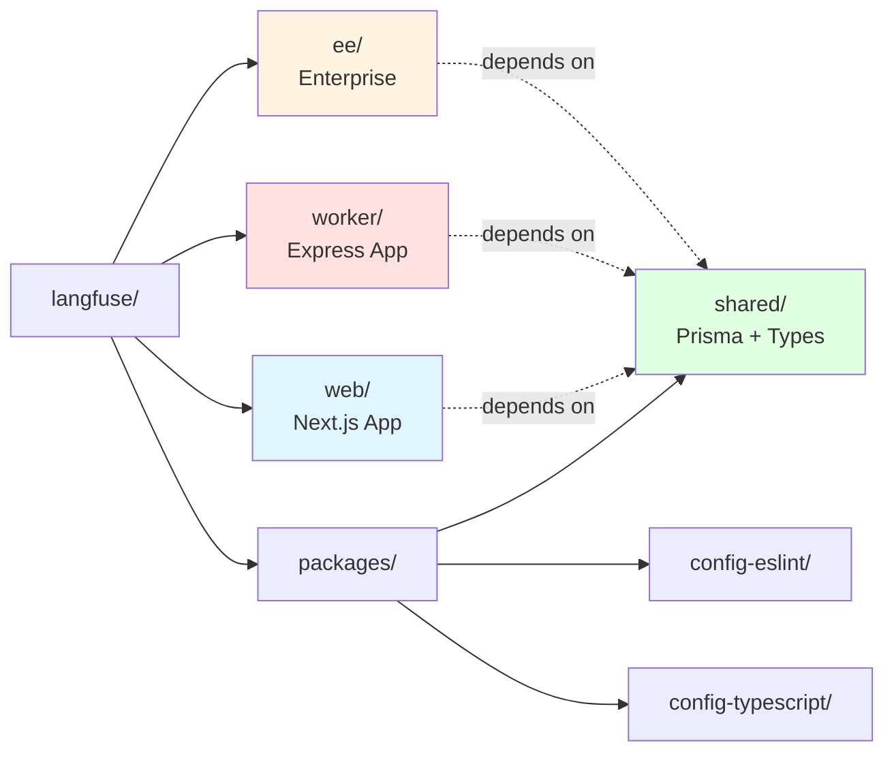
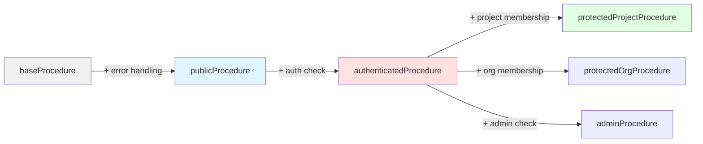
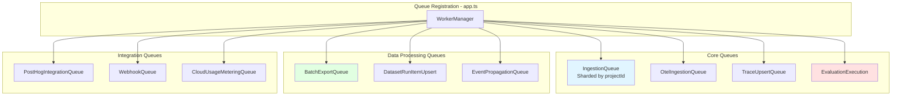
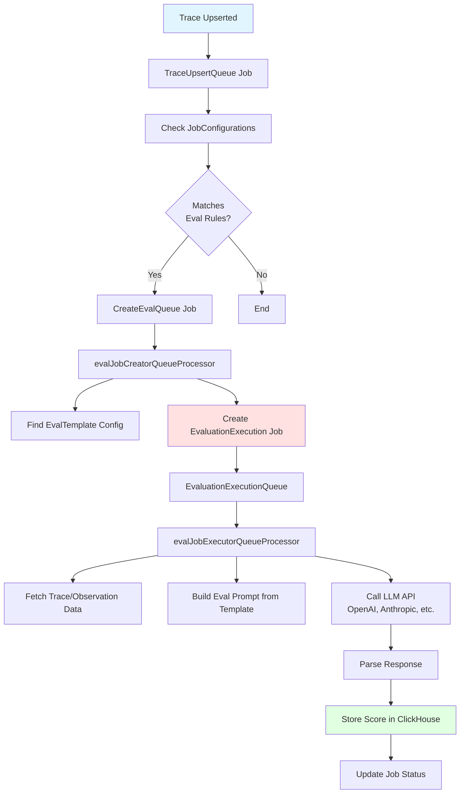
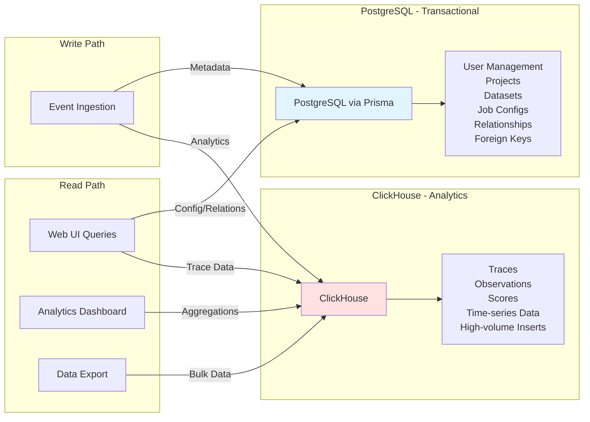
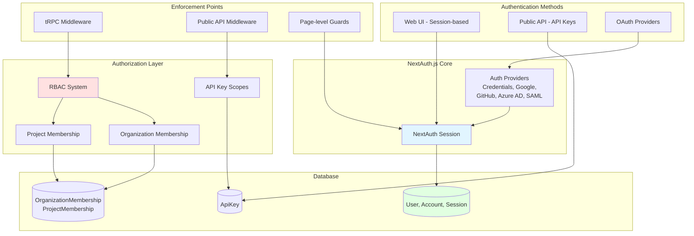
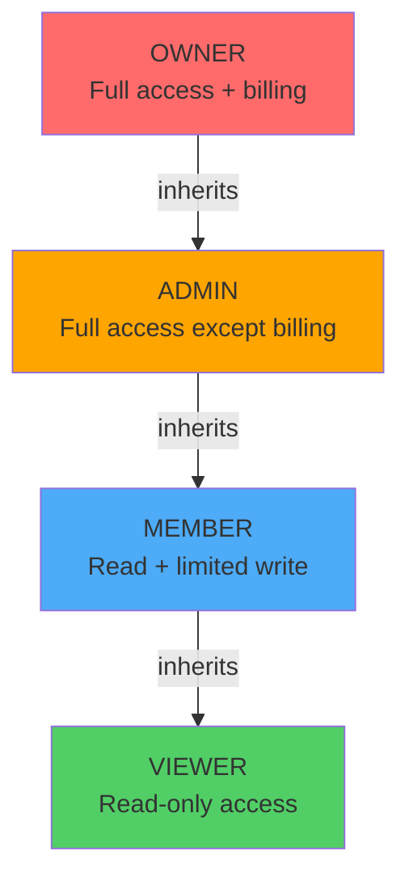

# Langfuse System Architecture

> **Part 1 of 4** - [Overview](analysis.md) | [System Architecture](analysis-system-architecture.md) | [Data Flows](analysis-data-flows.md) | [Recommendations](analysis-recommendations.md)

## 1. System Architecture Overview

### 1.1 High-Level Component Diagram



### 1.2 Monorepo Structure



## 2. Web Application Architecture

### 2.1 Feature-Based Organization

The web application contains **50+ feature directories** in `/web/src/features/`:

```
features/
├── datasets/          # Dataset management
├── evals/            # Evaluation system
├── prompts/          # Prompt versioning
├── projects/         # Project settings
├── rbac/             # Access control
├── public-api/       # Public API types
├── auth/             # Authentication
├── organizations/    # Org management
├── dashboard/        # Analytics
├── experiments/      # A/B testing
└── ... (40+ more)
```

**Standard Feature Structure:**

```
features/[feature-name]/
├── components/          # React UI components
├── contexts/           # React contexts
├── server/
│   ├── [feature]Router.ts   # tRPC router
│   ├── service.ts          # Business logic
│   └── actions/            # Server actions
├── hooks/             # Custom React hooks
├── types/             # TypeScript types
└── utils/             # Helper functions
```

### 2.2 tRPC Procedure Types



## 3. Worker Application Architecture

### 3.1 BullMQ Queue System

The worker registers **30+ queue processors**:



### 3.2 Evaluation Pipeline



## 4. Database Architecture

### 4.1 Dual Database Strategy



**Division of Responsibility:**

| PostgreSQL | ClickHouse |
|------------|------------|
| Users, Organizations | Trace records |
| Projects, Memberships | Observation records |
| Datasets, Items | Score records |
| Job Configurations | High-cardinality analytics |
| Prompt Versions | Time-series aggregations |
| Model Pricing | Session analytics |
| RBAC & Permissions | Generation metrics |
| Foreign Key Constraints | Event logs |

## 5. Authentication & Authorization

### 5.1 Multi-Layer Auth Architecture



### 5.2 RBAC Role Hierarchy



---

**Continue to:** [Part 2: Data Flows →](analysis-data-flows.md)
