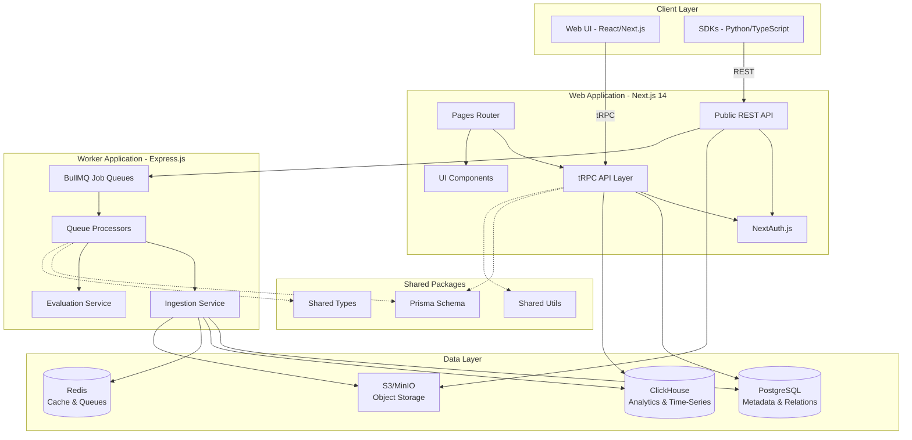
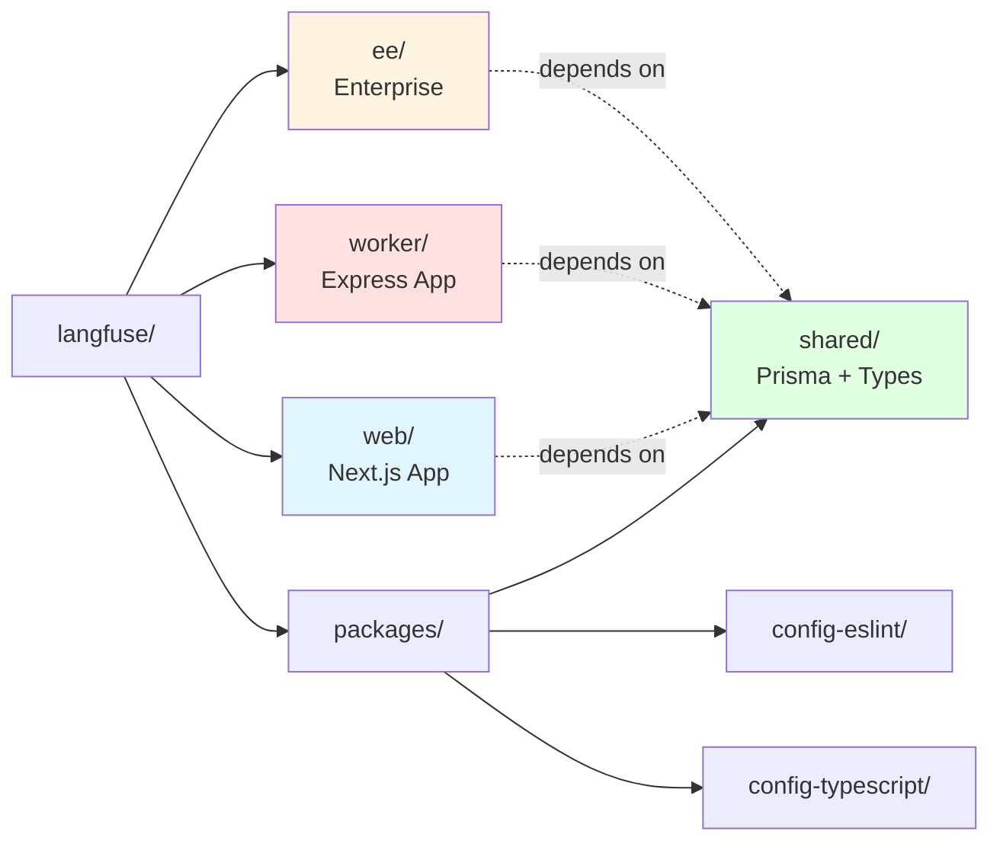
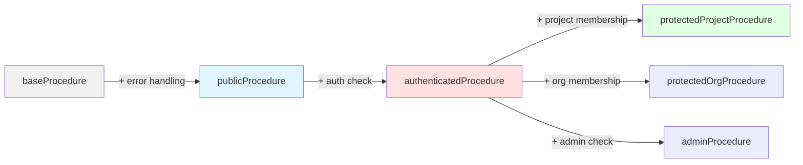
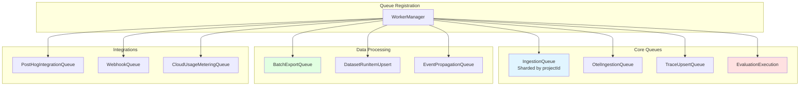
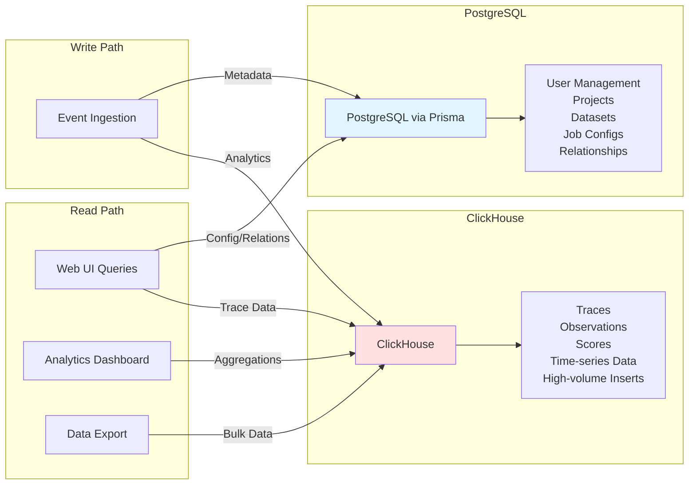
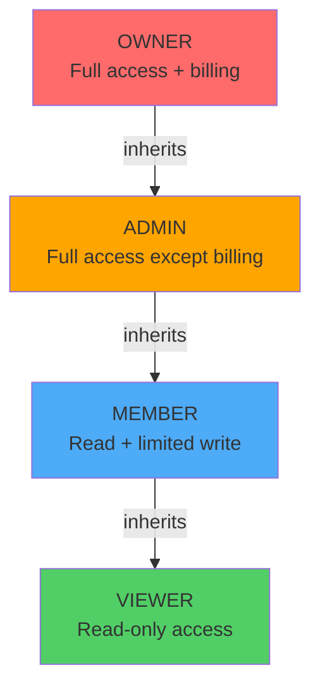

# Langfuse Architecture Analysis - Part 1: System Architecture

> **Navigation:** [📋 Index](./analysis-index.md) | **Part 1: Architecture** | [Part 2: Data Flows →](./analysis-02-dataflows.md)

---

## 1. System Architecture Overview

### 1.1 High-Level Component Diagram



### 1.2 Monorepo Structure



---

## 2. Web Application Architecture

### 2.1 Feature-Based Organization

The web application contains **50+ feature directories** in `/web/src/features/`:

```
features/
├── datasets/          # Dataset management
├── evals/            # Evaluation system
├── prompts/          # Prompt versioning
├── projects/         # Project settings
├── rbac/             # Access control
├── public-api/       # Public API types
├── auth/             # Authentication
├── organizations/    # Org management
├── dashboard/        # Analytics
├── experiments/      # A/B testing
└── ... (40+ more)
```

**Standard Feature Structure:**

```
features/[feature-name]/
├── components/          # React UI components
├── contexts/           # React contexts
├── server/
│   ├── [feature]Router.ts   # tRPC router
│   ├── service.ts          # Business logic
│   └── actions/            # Server actions
├── hooks/             # Custom React hooks
├── types/             # TypeScript types
└── utils/             # Helper functions
```

### 2.2 tRPC Procedure Types



**Context Creation** (`/web/src/server/api/trpc.ts`):

```typescript
export const createInnerTRPCContext = (opts: CreateContextOptions) => {
  return {
    session: opts.session,      // User session (NextAuth)
    headers: opts.headers,       // HTTP headers
    prisma,                      // Prisma client
    DB,                          // Kysely query builder
  };
};
```

### 2.3 Public API Architecture

**Location:** `/web/src/pages/api/public/`

**Middleware Chain** (`/features/public-api/server/withMiddlewares.ts`):

1. CORS preflight handling
2. OpenTelemetry context propagation
3. Error handling (BaseError, ClickHouseResourceError, ZodError)
4. Route execution

**API Route Helpers:**

- `createAuthedAPIRoute` - Requires API key, no specific project
- `createAuthedProjectAPIRoute` - Requires project-scoped API key
- `createLegacyAuthedAPIRoute` - Legacy authentication

### 2.4 Pages and Routing

**Structure:**

```
pages/
├── _app.tsx                          # App wrapper with providers
├── api/
│   ├── trpc/[trpc].ts               # tRPC endpoint
│   └── public/                       # Public API endpoints
├── auth/                             # Auth pages (sign-in, etc.)
├── project/[projectId]/              # Project-scoped pages
│   ├── datasets/
│   ├── traces/
│   ├── prompts/
│   └── settings/
└── organization/[organizationId]/    # Org-scoped pages
    ├── settings/
    └── members/
```

---

## 3. Worker Application Architecture

### 3.1 BullMQ Queue System

**Entry Point:** `/worker/src/app.ts` (522 lines)

The worker registers **30+ queue processors**:



**Worker Registration Pattern:**

```typescript
// Check if queue is enabled via env var
if (env.QUEUE_CONSUMER_INGESTION_QUEUE_IS_ENABLED === "true") {
  // Get shard names for parallel processing
  const shardNames = IngestionQueue.getShardNames();

  shardNames.forEach((shardName) => {
    WorkerManager.register(
      shardName as QueueName,
      ingestionQueueProcessorBuilder(true),
      {
        concurrency: env.LANGFUSE_INGESTION_QUEUE_PROCESSING_CONCURRENCY,
        lockDuration: 60000,      // 60s job lock
        stalledInterval: 120000   // 120s stalled check
      }
    );
  });
}
```

### 3.2 Key Components

**IngestionService** (`/worker/src/services/IngestionService/index.ts`):
- Merges multiple events for same trace/observation
- Async tokenization (tiktoken via worker threads)
- Cost calculation from model pricing table
- Validation against prompt versions and models
- Dual database writes

**ClickhouseWriter** (`/worker/src/services/ClickhouseWriter/`):
- Batched async inserts
- Table-specific insert queues
- Automatic flushing on size/time thresholds
- Handles INSERT failures with retries

---

## 4. Database Architecture

### 4.1 Dual Database Strategy



**Division of Responsibility:**

| PostgreSQL | ClickHouse |
|------------|------------|
| Users, Organizations | Trace records |
| Projects, Memberships | Observation records |
| Datasets, Items | Score records |
| Job Configurations | High-cardinality analytics |
| Prompt Versions | Time-series aggregations |
| Model Pricing | Session analytics |
| RBAC & Permissions | Generation metrics |
| Foreign Key Constraints | Event logs |

### 4.2 Database Interaction Patterns

**Three Query Approaches:**

1. **Prisma ORM** - Type-safe, relational
2. **Kysely Query Builder** - Complex SQL, CTEs
3. **Raw SQL** - Maximum flexibility

**ClickHouse Client** (`@clickhouse/client`):
```typescript
const result = await clickhouseClient.query({
  query: `
    SELECT
      project_id,
      count() as trace_count,
      sum(total_cost) as total_cost
    FROM traces
    WHERE timestamp >= {start:DateTime64}
      AND timestamp < {end:DateTime64}
      AND project_id = {projectId:String}
    GROUP BY project_id
  `,
  query_params: { start, end, projectId },
  format: "JSONEachRow"
});
```

---

## 5. Authentication & Authorization

### 5.1 RBAC Role Hierarchy



**Permission Scopes**:

| Scope | Owner | Admin | Member | Viewer |
|-------|-------|-------|--------|--------|
| Project Settings | ✅ | ✅ | ❌ | ❌ |
| Create Prompts | ✅ | ✅ | ✅ | ❌ |
| Delete Traces | ✅ | ✅ | ❌ | ❌ |
| Manage API Keys | ✅ | ✅ | ❌ | ❌ |
| View Dashboard | ✅ | ✅ | ✅ | ✅ |
| Create Datasets | ✅ | ✅ | ✅ | ❌ |
| Score Traces | ✅ | ✅ | ✅ | ❌ |

### 5.2 API Key Scopes

**API keys can be:**
- **Project-scoped:** Access to single project
- **Organization-scoped:** Access to all projects in org

---

**Next:** [Part 2: Data Flows & Integration →](./analysis-02-dataflows.md)
