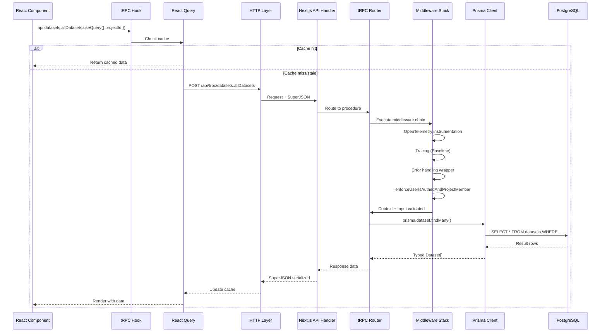
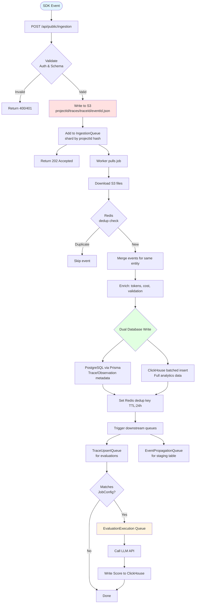
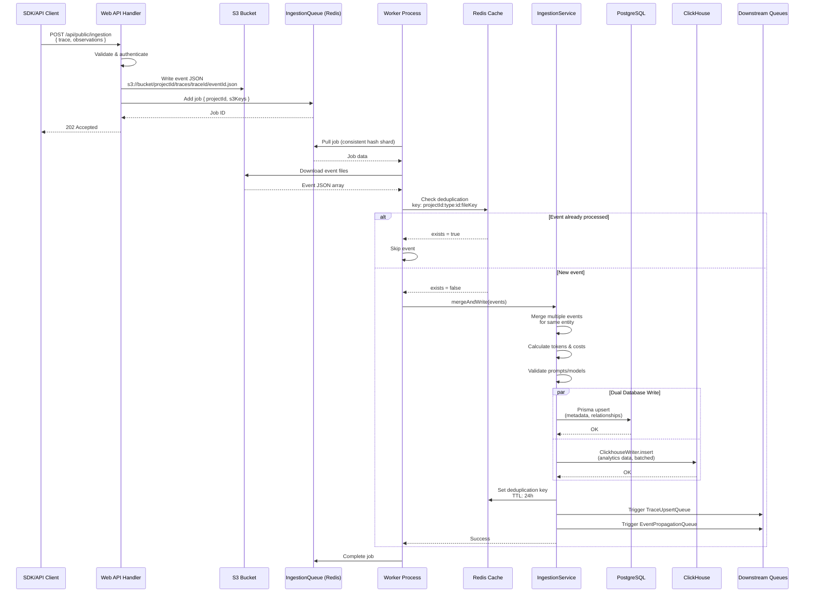
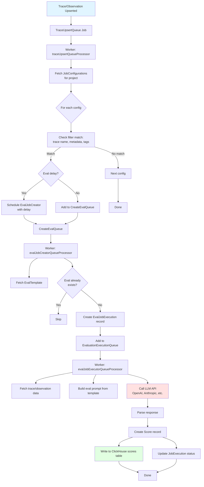
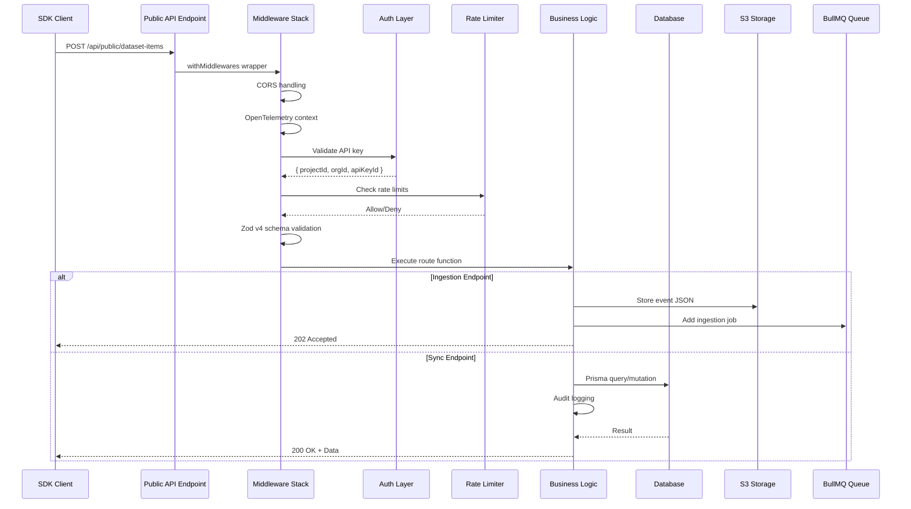

# Langfuse Architecture Analysis - Part 2: Data Flows & Integration

> **Navigation:** [📋 Index](./analysis-index.md) | [← Part 1: Architecture](./analysis-01-architecture.md) | **Part 2: Data Flows** | [Part 3: Analysis →](./analysis-03-analysis.md)

---

## 1. Frontend → tRPC → Database

This flow shows how a typical user interaction in the web UI retrieves data from the database.



**Key Points:**
- React Query provides automatic caching
- SuperJSON handles complex types (Date, BigInt, etc.)
- Middleware chain enforces auth and observability
- Type safety maintained end-to-end

---

## 2. SDK → S3 → Worker → Databases (Ingestion Pipeline)

This is the complete flow for ingesting trace data from SDKs into Langfuse.



**Key Components:**

1. **S3 Event Storage** (`/worker/src/queues/ingestionQueue.ts:81-150`)
   - Events stored as JSON files
   - Batched downloads for efficiency
   - Fallback to legacy queue if S3 fails

2. **Redis Deduplication** (`/worker/src/queues/ingestionQueue.ts:81-103`)
   ```typescript
   const key = `langfuse:ingestion:recently-processed:${projectId}:${type}:${eventBodyId}:${fileKey}`;
   const exists = await redis.exists(key);
   if (exists) return; // Skip duplicate
   await redis.set(key, "1", "EX", 86400); // 24h TTL
   ```

3. **IngestionService** (`/worker/src/services/IngestionService/index.ts`)
   - Merges multiple events for same trace/observation
   - Async tokenization (tiktoken via worker threads)
   - Cost calculation from model pricing table
   - Validation against prompt versions and models
   - Dual database writes

4. **ClickhouseWriter** (`/worker/src/services/ClickhouseWriter/`)
   - Batched async inserts
   - Table-specific insert queues
   - Automatic flushing on size/time thresholds
   - Handles INSERT failures with retries

---

## 3. Detailed Ingestion Sequence

This shows the full detail of the ingestion pipeline with all participants:



---

## 4. Evaluation Trigger Flow

This flow shows how evaluations are automatically triggered after trace ingestion:



**Configuration-Driven Evaluation:**

- `JobConfiguration` table defines eval rules
- Matches traces based on filters (trace name, metadata, etc.)
- Triggers evaluation jobs automatically
- Supports custom LLM-based evaluators

---

## 5. Public API Request Flow

This shows how external API requests are processed:



**Middleware Chain:**
1. CORS preflight handling
2. OpenTelemetry context propagation
3. Error handling (BaseError, ClickHouseResourceError, ZodError)
4. API key authentication
5. Rate limiting
6. Zod v4 schema validation
7. Route execution

---

## 6. Data Flow Summary

### Write Paths
1. **User Actions (Web UI)** → tRPC → PostgreSQL
2. **SDK Events** → Public API → S3 → Queue → Worker → PostgreSQL + ClickHouse
3. **Evaluations** → Queue → Worker → ClickHouse

### Read Paths
1. **UI Dashboard** → tRPC → ClickHouse (analytics)
2. **UI Settings** → tRPC → PostgreSQL (config)
3. **Public API** → Direct → PostgreSQL/ClickHouse

### Async Processing
- **Ingestion:** S3 → Queue → Worker
- **Evaluations:** Trace Upsert → Eval Creator → Eval Executor
- **Exports:** Export Request → Queue → Worker → S3
- **Integrations:** Event → Queue → Worker → External API

---

**Next:** [Part 3: Pros, Cons & Scale Analysis →](./analysis-03-analysis.md)
