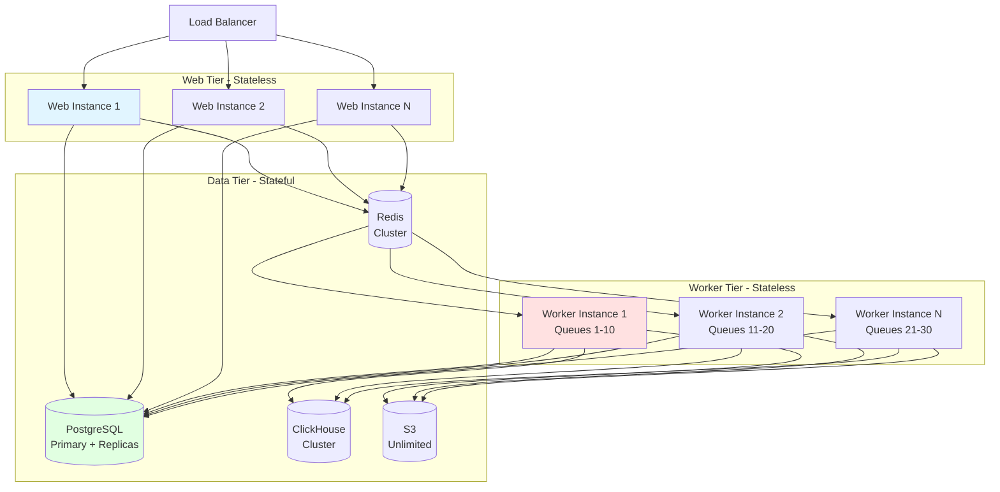

# Langfuse Architecture Analysis - Part 3: Pros, Cons & Scale Analysis

> **Navigation:** [📋 Index](./analysis-index.md) | [← Part 2: Data Flows](./analysis-02-dataflows.md) | **Part 3: Analysis** | [Part 4: Recommendations →](./analysis-04-recommendations.md)

---

## 1. Architectural Strengths

### 1.1 Type Safety End-to-End
**Pros:**
- tRPC provides full-stack type safety without code generation
- Changes to backend types immediately surface in frontend
- Zod schemas ensure runtime validation matches TypeScript types
- Reduces bugs from type mismatches

**Evidence:**
- 40+ tRPC routers with shared input/output schemas
- SuperJSON serialization handles complex types (Date, BigInt)
- Kysely provides type-safe SQL query building

### 1.2 Feature-Based Architecture
**Pros:**
- High cohesion: related code co-located in `/features/[name]/`
- Easy to understand feature boundaries
- Parallel team development without conflicts
- Clear ownership of feature domains

**Evidence:**
- 50+ feature directories with consistent structure
- Each feature has own router, services, components
- Examples: `datasets/`, `evals/`, `prompts/`

### 1.3 Dual Database Strategy
**Pros:**
- PostgreSQL handles relational data with ACID guarantees
- ClickHouse handles high-volume analytics efficiently
- Separation of concerns: config vs. analytics
- Optimal performance for each use case

**Evidence:**
- Metadata writes to PostgreSQL via Prisma
- Analytics writes to ClickHouse via batched inserts
- ClickHouse queries 10-100x faster for aggregations

### 1.4 Async Processing with Queues
**Pros:**
- Non-blocking ingestion (202 Accepted immediately)
- Horizontal scaling via worker instances
- Retry logic for failed jobs
- Isolated worker failures don't affect web app

**Evidence:**
- 30+ BullMQ queues for different job types
- Sharded queues for parallel processing
- S3 event storage allows replay

### 1.5 Modular Monorepo
**Pros:**
- Shared code in `/packages/shared/` (DRY principle)
- Single repository for web + worker + types
- Turbo caching speeds up builds
- Consistent tooling (ESLint, TypeScript)

**Evidence:**
- pnpm workspaces link packages
- Shared Prisma schema, types, utilities
- Single `pnpm dev` starts all services

### 1.6 Comprehensive Authorization
**Pros:**
- Multi-tenancy isolation via `projectId` filtering
- RBAC with granular scopes
- Middleware enforcement prevents bypasses
- Both session-based and API key auth

**Evidence:**
- tRPC middleware checks membership
- RBAC system with 4 role levels
- Public API validates API key scopes

### 1.7 Observability Built-In
**Pros:**
- OpenTelemetry instrumentation on all requests
- Distributed tracing with Baselime
- Error tracking with Sentry
- Custom event logging

**Evidence:**
- `withOtelInstrumentation` middleware
- `traceException()` helper for structured errors
- OpenTelemetry context propagation across services

---

## 2. Architectural Weaknesses

### 2.1 Large Router Files
**Cons:**
- Some routers exceed 2000 lines (e.g., `dataset-router.ts`: 2177 lines)
- Difficult to navigate and understand
- Harder to review in PRs
- Increased merge conflicts

**Impact:** Medium
**Location:** `/features/datasets/server/dataset-router.ts`: 2177 lines

### 2.2 Dual Database Complexity
**Cons:**
- Must write to both PostgreSQL + ClickHouse for each event
- Data consistency challenges (eventual consistency)
- Complex migrations (must update both schemas)
- Debugging requires checking two databases

**Impact:** High
**Evidence:** IngestionService writes to both databases

### 2.3 S3 as Message Queue
**Cons:**
- S3 not designed as queue intermediary
- Additional latency vs. direct writes
- Costs for S3 storage + requests
- Complexity of downloading files in worker

**Impact:** Medium
**Rationale:** Provides durability and replay capability

### 2.4 Tight Coupling to Next.js Pages Router
**Cons:**
- Pages Router is being superseded by App Router
- Migration to App Router would be significant effort
- Server components not available
- Layout patterns less elegant

**Impact:** Medium
**Evidence:** 100+ page files in `/pages/`

### 2.5 Monorepo Complexity
**Cons:**
- Large repository (100k+ LOC)
- Long initial setup time (`pnpm i`)
- Docker dependencies required (PostgreSQL, ClickHouse, Redis)
- Difficult for new contributors

**Impact:** Low
**Tradeoff:** Benefits of monorepo outweigh costs

### 2.6 Queue Processor Logic in Single File
**Cons:**
- `app.ts` (522 lines) registers 30+ queues
- Large conditional blocks for each queue
- Hard to test individual processors
- Difficult to enable/disable queues

**Impact:** Low

### 2.7 Implicit Feature Dependencies
**Cons:**
- Features can import from other features
- No enforced boundaries between features
- Risk of circular dependencies
- Hard to extract features to separate packages

**Impact:** Medium
**Evidence:** Cross-feature imports in `/features/`

### 2.8 Limited API Documentation
**Cons:**
- Public API docs via Fern require manual updates
- tRPC endpoints not documented for external consumption
- Internal API endpoints lack JSDoc comments
- Onboarding requires reading code

**Impact:** Low for internal use, High for API consumers

### 2.9 Test Coverage Gaps
**Cons:**
- Many features lack comprehensive tests
- Integration tests require full stack (DB, Redis, ClickHouse)
- Async tests difficult to write correctly
- Mock complexity for queue processors

**Impact:** Medium
**Evidence:** Test instructions emphasize avoiding `pruneDatabase`

### 2.10 ClickHouse Schema Evolution
**Cons:**
- Adding columns to ClickHouse requires migration + rebuild
- Large tables take hours to ALTER
- No easy rollback for schema changes
- Clustered deployments require coordination

**Impact:** High for production

---

## 3. Scale Considerations

### 3.1 Current Scale Indicators

Based on codebase analysis:

- **Codebase Size:** ~100,000+ lines of TypeScript
- **Feature Count:** 50+ feature directories
- **tRPC Routers:** 40+ sub-routers
- **Queue Types:** 30+ BullMQ queues
- **Database Tables:** 50+ PostgreSQL tables, 10+ ClickHouse tables

### 3.2 Scalability Analysis

**Horizontal Scaling Capabilities:**

### 3.3 Bottlenecks

**1. PostgreSQL Write Throughput**
- Mitigations: Read replicas, connection pooling, batch writes
- Scale ceiling: ~10k writes/sec on large instances

**2. ClickHouse Insert Rate**
- Current: Batched inserts via ClickhouseWriter
- Scale ceiling: 100k+ inserts/sec with proper sharding

**3. Redis Queue Throughput**
- Current: Sharded queues by projectId
- Scale ceiling: 100k+ jobs/sec with cluster

**4. S3 Request Rate**
- Mitigation: Batch downloads, prefixes for parallelism
- Scale ceiling: Effectively unlimited

### 3.4 Recommended Optimizations for 10x Scale

1. Implement read replicas for PostgreSQL
2. Partition ClickHouse tables by project_id
3. Increase queue sharding (more shards per queue type)
4. Add Redis caching layer for frequent queries
5. Implement CDN for static assets and public data

---

## 4. Technology Stack Summary

| Layer | Technology | Version | Purpose |
|-------|-----------|---------|---------|
| **Frontend** | React | 18 | UI library |
| | Next.js | 14 | Full-stack framework (Pages Router) |
| | Tailwind CSS | 3 | Styling |
| | shadcn/ui | Latest | Component library (Radix UI) |
| | TanStack Query | 5 | State management |
| **Backend** | tRPC | 11 | Type-safe API |
| | NextAuth.js | Latest | Authentication |
| | Prisma | 5 | PostgreSQL ORM |
| | Kysely | Latest | SQL query builder |
| | Zod | 4 | Runtime validation |
| **Worker** | Express.js | 4 | HTTP server |
| | BullMQ | 5 | Queue system |
| **Databases** | PostgreSQL | 15+ | Primary database |
| | ClickHouse | 24+ | Analytics database |
| | Redis | 7+ | Cache & queues |
| **Storage** | MinIO/S3 | N/A | Object storage |
| **Observability** | OpenTelemetry | Latest | Instrumentation |
| | Baselime | N/A | Tracing |
| | Sentry | Latest | Error tracking |
| **Tooling** | pnpm | 9.5.0 | Package manager |
| | Turbo | Latest | Monorepo build system |
| | TypeScript | 5+ | Type system |
| | ESLint | 8 | Linting |
| | Jest | 29 | Unit testing (web) |
| | Vitest | Latest | Unit testing (worker) |
| | Playwright | Latest | E2E testing |

---

## 5. Overall Assessment

### Maturity Level
**Production-ready with room for optimization**

### Architectural Grade
**A-**

Strong foundation with clear paths for optimization and scale.

### Key Takeaways

**Strengths:**
- Strong type safety through tRPC and TypeScript
- Clear feature boundaries with modular organization
- Effective dual database strategy for different workloads
- Robust async processing with BullMQ queues
- Comprehensive authorization with RBAC

**Primary Challenges:**
- Large router files need decomposition
- Dual database complexity requires careful coordination
- S3 intermediary adds latency to ingestion
- Pages Router is legacy, migration to App Router needed
- Limited test coverage in some areas

The Langfuse architecture successfully balances:
- **Developer Experience:** Type-safe APIs, feature-based organization
- **Performance:** Dual databases, async processing, horizontal scaling
- **Maintainability:** Monorepo structure, shared packages, consistent patterns

The codebase demonstrates thoughtful engineering decisions and clear patterns that enable the team to iterate quickly while maintaining quality.

---

**Next:** [Part 4: Improvement Recommendations →](./analysis-04-recommendations.md)
